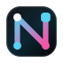

<p>
  
</p>

# Nextrace

Trace the intelligence.

Nextrace is a local-first Python toolkit for tracing AI workflows. It records execution steps, latency, token usage, cost, errors, tool calls, retrieval, handoffs, scores, and feedback in SQLite, then presents them in a local dashboard.

Use Nextrace with instrumented Python code, MCP servers, or local Codex, Claude Code, and Pi usage logs.

## Install

Requires Python 3.10 or later.

```bash
git clone https://github.com/philipbloch/Nextrace.git
cd Nextrace
python3 -m venv .venv
. .venv/bin/activate
python -m pip install -e ".[dashboard]"
```

Install only the dependency-free core package with `python -m pip install -e .`.

## Quick start

```python
from nextrace import ai_trace

with ai_trace("support-bot", session_id="ticket-123") as trace:
    result = agent.run(message)

    trace.model_call(
        provider="openai",
        model="gpt-4.1-mini",
        prompt=message,
        response=result,
    )
    trace.tool_call(
        name="lookup_order",
        arguments={"order_id": "1001"},
        result={"status": "shipped"},
        success=True,
    )
    trace.score("helpfulness", 0.92)
```

Traces are written to `~/.nextrace/traces.db` by default.

Start the dashboard:

```bash
nextrace dashboard
```

Open [http://127.0.0.1:8765](http://127.0.0.1:8765).

## Connect data

### Python integrations

Nextrace includes helpers for:

- OpenAI: `traced_openai_chat` and `async_traced_openai_chat`
- Anthropic: `traced_anthropic_messages` and `async_traced_anthropic_messages`
- Gemini: `traced_gemini_generate`
- JSON HTTP endpoints: `traced_http_json`
- Local sync or async functions: `traced_model_call`

Provider clients remain optional. Install convenience extras when needed:

```bash
python -m pip install -e ".[openai,anthropic,gemini]"
```

### Local coding agents

Import changed Codex, Claude Code, and Pi usage logs with one command:

```bash
nextrace import-local-usage
```

The importer groups records by project, tracks imported files, and stores token and cost metadata without raw prompts or responses. Use `--source codex`, `--source claude`, or `--source pi` to select one source.

### MCP

Proxy a stdio MCP server:

```bash
nextrace mcp-proxy \
  --application auto \
  --server my-server \
  -- uvx my-mcp-server
```

Proxy an HTTP MCP endpoint:

```bash
nextrace mcp-http-proxy \
  --application auto \
  --server my-server \
  --target https://mcp.example.com/mcp
```

MCP proxies record tool names, timing, status, response size, and redacted argument shapes. They do not store raw tool output, auth headers, cookies, or tokens.

## Commands

| Command | Purpose |
| --- | --- |
| `nextrace dashboard` | Run the local dashboard |
| `nextrace import-local-usage` | Import changed Codex, Claude Code, and Pi logs |
| `nextrace codex-import` | Import selected Codex sessions |
| `nextrace claude-import` | Import selected Claude Code transcripts |
| `nextrace pi-import` | Import selected Pi sessions |
| `nextrace mcp-proxy` | Proxy a stdio MCP server |
| `nextrace mcp-http-proxy` | Proxy an HTTP MCP endpoint |
| `nextrace reprice` | Recalculate stored model costs |
| `nextrace set-project` | Set the project used by proxies in auto mode |

Run `nextrace <command> --help` for command options.

## Configuration

| Setting | Default | Purpose |
| --- | --- | --- |
| `NEXTRACE_DB` | `~/.nextrace/traces.db` | SQLite database path |
| `NEXTRACE_APPLICATION` | Inferred | Application name used in auto mode |
| `NEXTRACE_PROJECT_STATE` | `~/.nextrace/current-project.json` | Active-project state file |
| `NEXTRACE_PRICING_FILE` | `~/.nextrace/pricing.json` | Custom model-pricing file |

Nextrace includes public pricing estimates for known OpenAI, Anthropic, and Gemini text models. Add exact provider/model rates in a pricing JSON file using the format in [`config/shopify-pricing.json`](config/shopify-pricing.json), then reprice existing spans:

```bash
nextrace reprice --provider shopify-proxy --model gpt-5.5
```

## Optional macOS services

The core library, dashboard, proxies, and importers are platform-independent. On macOS, the included installer can run the dashboard, HTTP MCP proxy, and recurring local importer as LaunchAgents:

```bash
scripts/install-launch-agents.sh
```

Defaults are dashboard port `8765`, proxy port `8766`, and a five-minute import interval. Override them with `NEXTRACE_DASHBOARD_PORT`, `NEXTRACE_TOOL_GATEWAY_PORT`, and `NEXTRACE_IMPORT_INTERVAL`.

## Data and privacy

- Nextrace stores data locally in SQLite.
- Python instrumentation stores the prompt, response, and metadata supplied by the caller.
- Local log importers and MCP proxies store redacted metadata instead of raw prompts, responses, tool output, or credentials.

## Development

```bash
python -m pytest
python -m ruff check .
```

Rebuild the dashboard UI:

```bash
cd dashboard-ui
npm ci
npm run build
```

Build the product site:

```bash
cd quick-site
npm ci
npm run build
```

## License

[MIT](LICENSE)
